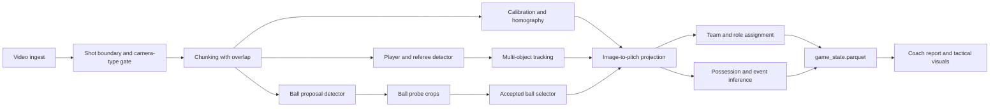
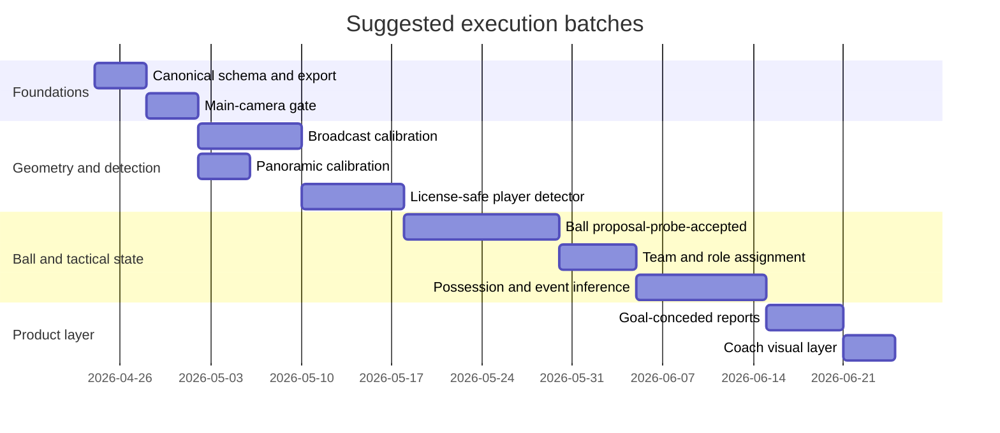

# Free and Open Football Match Reconstruction Pipeline

## Executive summary

From the uploaded bundle, your current blocker is not “can the pipeline produce something on one clip?” but “can it hold up across sources and styles?” The roadmap and current-state pack already describe a coherent single-clip proof floor, while the suite verdict remains `baseline_not_robust`. That means the next successful version should be less about another ad hoc detector swap and more about a stricter, stage-wise system: camera/shot gating, calibration, player tracking, ball recovery, team assignment, possession/event inference, and downstream tactical reporting, each with its own measurable gate.

For free and open supervision, the strongest combination is: **SoccerTrack v2** for full-pitch panoramic game-state supervision; **entity["organization","SoccerNet","soccer dataset benchmark"]** for broadcast-view field localization, camera calibration, tracking, game-state reconstruction, ball-action spotting, and camera-shot segmentation; **entity["company","SkillCorner","football tracking company"] Open Data** for broadcast tracking plus possession, dynamic events, and phases of play; **entity["company","Metrica Sports","sports analytics company"]** sample data for synchronized event+tracking validation; and **entity["company","StatsBomb","football analytics company"] Open Data** for event semantics, lineup structure, and 360 freeze-frame context. That mix covers panoramic and broadcast modes, calibration, tracking, ball, events, and tactical analytics better than any single public source does on its own. citeturn23view2turn23view3turn24view0turn24view1turn24view2turn24view3turn24view4turn24view5turn23view0turn23view1turn25view0

For the runtime stack, I would standardize on a **permissive** core first: FFmpeg for decoding and chunking, OpenCV for geometric ops, PyTorch for modeling, a player detector from MMDetection / YOLOX / RT-DETR, ByteTrack or Norfair for MOT, and optionally SAM 2 plus GroundingDINO as “assistive” modules for hard ball or occlusion cases. That keeps the core legally cleaner than continuing to center the stack on **entity["company","Ultralytics","computer vision company"]** or BoxMOT, which are the main licensing friction points if you want a permissive or future commercial-ready path. FFmpeg is LGPL by default but becomes GPL if GPL components are enabled; OpenCV’s Python wheels are Apache 2.0 for OpenCV itself but also redistribute FFmpeg/LGPL components; MMDetection, Detectron2, YOLOX, RT-DETR, SAM 2, and GroundingDINO are permissive; ByteTrack is MIT and Norfair is BSD-3-Clause; BoxMOT is AGPL-3.0. citeturn29view2turn29view1turn3search2turn27view0turn27view1turn27view2turn27view3turn27view4turn27view5turn30search1turn28view0turn28view1turn27view6turn9search4

The most important architectural change I would make to your current code is this: keep 5 FPS as a **fast-preview/debug mode**, but make **metric pitch coordinates** the canonical output schema and build the final coach-facing product around `game_state.parquet`. SkillCorner stores tracking in meters centered on the pitch, Metrica uses a known 105x68 m pitch, SoccerTrack v2 supervises pitch coordinates directly, and SoccerNet GSR is explicitly a minimap/radar-style world-state task. That will make calibration outputs, tracking outputs, and tactical analytics live in one consistent interface instead of being loosely coupled post-hoc. citeturn23view0turn23view1turn23view3turn24view1turn25view2

## Resource inventory

### Recommended datasets

| Resource | License and usage note | Exact relevance to stages | Recommendation |
|---|---|---|---|
| **SoccerTrack v2** citeturn23view2turn23view3 | Repo code is **MIT**; dataset is **CC BY 4.0**; the official repo states both permit commercial use. | Best free source for **panoramic** supervision: 10 full matches, ~900 minutes, 4K full-pitch coverage, per-frame 2D pitch coordinates, persistent track IDs, roles, team assignments, jersey numbers, and 12 ball-action classes. Ideal for **GSR supervision, panorama calibration sanity checks, track stitching, team/role heads, and ball-event alignment**. | **Highest-value public panoramic resource.** Use it as the teacher dataset for full-pitch tactical state. |
| **SoccerNet broadcast tasks** citeturn24view0turn24view1turn24view2turn24view3turn24view5turn13search13 | Videos are **NDA-gated**, **research-only**, and **not for commercial use**; algorithms have their own repo-by-repo licenses. citeturn24view4 | Best free source for **broadcast** supervision. Field localization and camera calibration use **20,028 images**; tracking provides **100 30-second 1080p clips** and HOTA evaluation; GSR provides **57 train / 59 val / 50 test** clips with GS-HOTA; BAS provides **7 broadcast videos** with dense 12-class ball actions; camera-shot segmentation can be used to detect **main camera vs replays / cuts**. | **Use heavily for broadcast calibration, main-cam gating, GSR evaluation, and BAS prototypes**, but do not rely on it for commercial product training. |
| **SkillCorner Open Data** citeturn23view0turn14search2 | Repo is **MIT**. | 10 A-League 2024/25 matches of **broadcast tracking**. Match folders include tracking JSONL, ball data, per-frame possession, image-corners projection, player data, dynamic events, and phases of play, with tracking at **10 fps** and pitch coordinates in **meters** centered on the pitch. Excellent for **broadcast-specific possession-chain supervision, team-shape analytics, and validating event heuristics against tracking**. | **Highest-value public broadcast-tracking dataset for downstream tactical logic.** |
| **Metrica Sports sample data** citeturn23view1 | Official README asks users to be responsible and acknowledge the source publicly; a standard permissive dataset license was **not clearly surfaced in the retrieved README**, so verify before redistribution. | Small but extremely useful because **tracking and event data are synchronized**, pitch dimensions are stated, and one sample is available in FIFA/EPTS-style format that the README explicitly recommends reading with Kloppy. Best for **developing pass/carry/possession logic before your CV stack is fully reliable**. | **Use as a development and validation set**, not as your sole benchmark. |
| **StatsBomb Open Data and 360** citeturn25view0 | Public-use repository intended for **research projects and genuine interest in football analytics**; attribution and use of the StatsBomb logo are requested when publishing work. | Excellent for **downstream analytics**, event semantics, lineups, possessions, and freeze-frame context from the `three-sixty` folder. Not a CV tracking dataset, but very useful for **possession chain logic, SPADL/xT/VAEP, and coach-report semantics**. | **Use for analytics and event-language standardization, not raw CV supervision.** |
| **SoccerNet camera-shot segmentation** citeturn13search13 | Same SoccerNet restrictions as above. | Labels each frame among **13 camera types** and provides **camera-shot boundary detection**. This is especially valuable to keep your tactical-state pipeline on **main gameplay camera only**, while suppressing replays, crowd shots, and non-analysis views. | **Strongly recommended** as a gating task for broadcast pipelines. |

### Recommended tools

#### Vision runtime and model stack

| Tool | License note | Why it matters | Recommendation |
|---|---|---|---|
| **FFmpeg** citeturn29view2 | **LGPL 2.1+** by default; **GPL** applies if you enable GPL parts. | Best open utility for **decode, transcode, frame-accurate chunking, overlap windows, and clip export**. | **Core dependency.** Compile or install in an LGPL-safe mode if you want the cleanest downstream licensing story. |
| **OpenCV** citeturn29view1 | OpenCV itself is **Apache 2.0** in the wheel, but wheels also redistribute FFmpeg/LGPL and other third-party libs. | Essential for **homography fitting, perspective transforms, interpolation, geometry, and frame I/O**. | **Core dependency.** Keep a note of wheel-level third-party license baggage. |
| **PyTorch** citeturn3search2turn29view0 | **BSD-style** permissive terms. | Standard training/inference base for modern detectors, trackers, and segmentation models. | **Core dependency.** |
| **MMDetection** citeturn27view0 | **Apache 2.0**. | Flexible training framework for custom detectors and detection research. Good when you want **reproducible configs and model swapping**. | **Recommended** for training custom player / referee / ball detectors if you want structured experimentation. |
| **YOLOX** citeturn27view2 | **Apache 2.0**. | Mature, fast detector that remains a strong choice for **real-time or near-real-time player detection**. | **Recommended** when you want a YOLO-like stack without AGPL friction. |
| **RT-DETR** citeturn27view3 | **Apache 2.0**. | Strong real-time detector family with good deployment support. Useful when you want a **license-safe alternative** to Ultralytics-style workflows. | **Recommended default detector family** for a clean, modern stack. |
| **ByteTrack** citeturn27view4 | **MIT**. | Very strong, simple MOT baseline. Particularly useful for **player track continuity from detector boxes**. | **Recommended default tracker**. |
| **Norfair** citeturn27view5 | **BSD-3-Clause**. | Lightweight tracker that can sit behind any detector and supports moving-camera scenarios and custom distance functions. | **Recommended secondary tracker** for ablations, fallback, or ball-specific custom logic. |
| **SAM 2** citeturn27view7turn30search1 | **Apache 2.0** for checkpoints, demo code, and training code. | Helpful as an **assistive video-segmentation module** for ambiguous ball locations, hard occlusions, and human-in-the-loop annotation acceleration. | **Use as an assistant**, not the primary player tracker. |
| **GroundingDINO** citeturn28view0turn28view1 | **Apache 2.0**. | Useful for **open-vocabulary proposal generation** and semi-automatic annotation bootstrapping. | **Good optional assistant**, especially in data-curation workflows. |
| **Detectron2** citeturn27view1 | **Apache 2.0**. | Production-friendly detection/segmentation library with exportability. | Good alternative if your team already knows it. |
| **Ultralytics** citeturn27view6 | Dual/commercial licensing model with its own terms. | Your current repo imports it, but it is the main licensing mismatch if you want a clearly permissive or future commercial-safe stack. | **Avoid as the canonical backbone** unless you are comfortable with its license path. |
| **BoxMOT** citeturn9search4 | **AGPL-3.0**. | Convenient tracker bundle, but AGPL is often a poor fit for product pipelines. | **Do not make it core** unless AGPL is acceptable for your deployment model. |

#### Annotation, evaluation, and analytics stack

| Tool | License note | Why it matters | Recommendation |
|---|---|---|---|
| **CVAT** citeturn25view4turn28view2 | **MIT** for the code; serverless assets can carry other licenses; it also uses FFmpeg libraries. | Best free tool here for **video tracks, interpolation, frame QA, and dense frame annotation**. | **Primary annotation tool** for boxes, tracks, ball points, line points, and roles. |
| **Label Studio** citeturn25view5 | **Apache 2.0**. | Excellent for **event spans, reviewer workflows, free-form QA fields, and non-box annotations**. | **Secondary annotation tool** for possession spans, event QA, and coach-review forms. |
| **FiftyOne** citeturn26view0turn26view1turn26view2turn28view3 | **Apache 2.0**. | Very strong for **dataset curation, sample-level error analysis, evaluation panels, and false-positive/false-negative exploration**. | **Highly recommended** as your visual QA and evaluation workbench. |
| **Kloppy** citeturn25view2turn26view3 | **BSD-3-Clause**. | Standardizes event and tracking providers into a common data model and exports to Pandas/Polars. | **Use as the ingestion normalization layer**. |
| **socceraction** citeturn22view1 | **MIT**. | Provides **SPADL**, **xT**, and **VAEP** from event streams. | **Use for action valuation once possession/event extraction is stable.** |
| **floodlight** citeturn22view0 | **MIT**. | Sports-analytics framework with parsers, public-dataset access, filtering, plotting, and model overlays. | **Useful companion** for exploratory spatiotemporal analytics. |
| **DataBallPy** citeturn25view3turn26view4 | **MIT**. | Specializes in **synchronizing tracking and event data** into one game object. | **Recommended** when you need clean event/tracking alignment. |
| **TrackEval** and **SoccerNet TrackEval** citeturn28view4turn28view5 | **MIT**. | Official reference implementation for **HOTA**; SoccerNet fork adds **SoccerNet MOT and GSR metrics**. | **Use as the evaluation backend**. |
| **mplsoccer** citeturn26view5turn17search0turn17search1turn17search3turn17search5 | **MIT**. | Best free plotting library here for **pitch maps, pass networks, radar charts, heatmaps, and coach-facing visuals**. | **Recommended visualization standard**. |
| **statsbombpy** citeturn31search0 | Official Python client from StatsBomb. | Easiest way to pull **StatsBomb open data** into Python. | **Convenient ingestion helper**, though Kloppy/socceraction are better for standardized downstream modeling. |

## Integration blueprint

The practical target should be **analysis-ready game state**, not “recreate anything” in the cinematic sense. With only a single broadcast or panoramic feed, a strong free/open stack can reconstruct an accurate minimap state, possession chains, team shape, passes/carries, and goal-conceded reports. It will not give you broadcast-grade photorealistic novel-view replay without substantially more data or more specialized multiview/3D systems. SoccerNet GSR and SoccerTrack v2 both frame the achievable open problem as **world-state reconstruction from video**, which aligns directly with your tactical-analysis end goal. citeturn24view1turn23view3

For modality choice, the rule is simple. **Panoramic/full-pitch video** is the easiest way to get reliable team shape and off-ball structure, because the whole field is visible and SoccerTrack v2 already supervises exactly that condition. **Broadcast video** is harder because off-camera players disappear, so you need stronger calibration, shot filtering, temporal smoothing, and more conservative coach-facing claims. Kloppy’s own tracking-data docs explicitly note that broadcast-based tracking only includes the on-camera players, while in-stadium or full-pitch systems are more complete. citeturn23view3turn25view2turn10search13

image_group{"layout":"carousel","aspect_ratio":"16:9","query":["soccer broadcast main camera match", "football panoramic tactical camera full pitch", "football tactical radar visualization"], "num_per_query": 1}

A good blueprint for both modalities looks like this:



That architecture mirrors the benchmark structure of SoccerNet’s calibration, tracking, GSR, and BAS tasks, while also matching SkillCorner’s tracking-plus-possession-plus-phases data model closely enough that you can use it both for supervision and for output sanity checks. citeturn24view0turn24view1turn24view3turn24view5turn23view0

### Canonical data model

I would change your canonical coordinate system from a normalized `100x100` internal space to **metric pitch coordinates**:

- `pitch_x_m` in `[0, 105]`
- `pitch_y_m` in `[0, 68]`
- optional derived normalized views like `pitch_x_pct`, `pitch_y_pct`

That matches the explicit metric conventions in SkillCorner and Metrica, and it is naturally compatible with SoccerTrack v2’s 2D pitch-coordinate supervision. citeturn23view0turn23view1turn23view3

### Ingestion and chunking

For a 90-minute file, chunk by **time with overlap**, not by arbitrary frame count. Recommended defaults:

- **Broadcast:** 20-second chunks with 2-second overlap
- **Panoramic:** 45-second chunks with 3-second overlap
- Keep **global frame/time IDs** so you can stitch later
- Start with **preview at 5 FPS**, then promote to **10 FPS canonical extraction** for ball and possession layers

```python
import subprocess
from pathlib import Path

def chunk_video_ffmpeg(
    input_path: str,
    out_dir: str,
    chunk_seconds: int = 20,
    overlap_seconds: int = 2,
    fps: int = 10,
) -> None:
    out = Path(out_dir)
    out.mkdir(parents=True, exist_ok=True)

    # Re-encode to stable CFR first
    cfr_path = out / "cfr_input.mp4"
    subprocess.run(
        [
            "ffmpeg", "-y", "-i", input_path,
            "-vf", f"fps={fps}",
            "-vsync", "cfr",
            "-c:v", "libx264", "-preset", "fast", "-crf", "18",
            "-an",
            str(cfr_path),
        ],
        check=True,
    )

    step = chunk_seconds - overlap_seconds
    # Segment into overlapping chunks by repeated trim
    # More verbose than the segment muxer, but explicit and easy to debug
    probe = subprocess.run(
        [
            "ffprobe", "-v", "error", "-show_entries", "format=duration",
            "-of", "default=noprint_wrappers=1:nokey=1", str(cfr_path)
        ],
        check=True, capture_output=True, text=True
    )
    duration = float(probe.stdout.strip())

    chunk_id = 0
    start = 0.0
    while start < duration:
        end = min(start + chunk_seconds, duration)
        out_path = out / f"chunk_{chunk_id:04d}.mp4"
        subprocess.run(
            [
                "ffmpeg", "-y", "-i", str(cfr_path),
                "-ss", f"{start:.3f}", "-to", f"{end:.3f}",
                "-c:v", "libx264", "-preset", "fast", "-crf", "18",
                "-an",
                str(out_path),
            ],
            check=True,
        )
        chunk_id += 1
        start += step
```

This is the simplest robust pattern for debugging. If you later optimize, keep the same chunk contract. The important thing is not the specific command; it is the **stable overlap and global time accounting**.

### Dataset adapters

Use one small adapter layer so every public source becomes the same internal structure.

```python
from dataclasses import dataclass
from typing import Any, Iterable

@dataclass
class FrameState:
    source: str
    match_id: str
    frame_idx: int
    timestamp_ms: int
    image_path: str | None
    homography: list[list[float]] | None
    players: list[dict[str, Any]]
    ball: dict[str, Any] | None
    events: list[dict[str, Any]]
    possession: dict[str, Any] | None

def adapt_soccertrack_gsr(frame_json: dict) -> FrameState:
    return FrameState(
        source="soccertrack_v2",
        match_id=str(frame_json["match_id"]),
        frame_idx=int(frame_json["frame"]),
        timestamp_ms=int(frame_json["timestamp_ms"]),
        image_path=frame_json.get("image_path"),
        homography=None,  # usually not needed because supervision is already in pitch coords
        players=frame_json["players"],   # includes pitch coords, roles, team, jersey, track id
        ball=frame_json.get("ball"),
        events=frame_json.get("events", []),
        possession=None,
    )

def adapt_skillcorner_tracking(row: dict) -> FrameState:
    return FrameState(
        source="skillcorner_open",
        match_id=str(row["match_id"]),
        frame_idx=int(row["frame"]),
        timestamp_ms=int(round(float(row["timestamp"]) * 1000)),
        image_path=None,
        homography=None,
        players=row["player_data"],
        ball=row.get("ball_data"),
        events=[],
        possession=row.get("possession"),
    )

def adapt_soccernet_clip_item(item: dict) -> FrameState:
    return FrameState(
        source="soccernet_gsr",
        match_id=str(item["match_id"]),
        frame_idx=int(item["frame"]),
        timestamp_ms=int(item["timestamp_ms"]),
        image_path=item["image_path"],
        homography=item.get("homography"),
        players=item.get("players", []),
        ball=item.get("ball"),
        events=item.get("events", []),
        possession=None,
    )
```

The point of this adapter layer is that **training**, **evaluation**, and **exports** stop caring about the original provider.

### Calibration recipe

For **broadcast**, calibration is a first-class problem, not a side effect. SoccerNet splits field localization and camera calibration for a reason: first infer pitch markings or line points, then solve projection and track reprojection error. Its camera-calibration evaluation is based on reprojection error, and its field-localization task gives you the semantic pitch elements you need to get there. citeturn24view2turn24view3

Recommended broadcast recipe:

1. Run a **camera-type/shot-boundary gate** to keep only main gameplay views and to reset calibration on cuts. SoccerNet camera-shot segmentation is the right public reference task for this. citeturn13search13  
2. Detect semantic pitch lines / line points every **1–2 seconds** or immediately after a cut.
3. Fit homography with RANSAC when you have enough line-point correspondences.
4. Smooth homography over time with Kalman or exponential smoothing in parameter space.
5. Reject homographies whose reprojection error or completeness degrades beyond threshold.

Recommended panoramic recipe:

1. Fit homography **once per opening chunk**.
2. Refresh only on confidence drop or visible camera drift.
3. Because the camera is effectively static, spend the saved compute budget on better player/ball inference.

A minimal homography application function looks like this:

```python
import cv2
import numpy as np

def image_to_pitch(points_xy, H):
    pts = np.asarray(points_xy, dtype=np.float32).reshape(-1, 1, 2)
    mapped = cv2.perspectiveTransform(pts, H).reshape(-1, 2)
    return mapped

def project_detection_footpoint(box_xyxy, H):
    x1, y1, x2, y2 = box_xyxy
    foot = np.array([[(x1 + x2) / 2.0, y2]], dtype=np.float32).reshape(-1, 1, 2)
    pitch_xy = cv2.perspectiveTransform(foot, H).reshape(-1, 2)[0]
    return float(pitch_xy[0]), float(pitch_xy[1])
```

If you want a concrete modeling split, I would train:

- a **line/point detector** on SoccerNet field-localization + camera-calibration tasks
- a **player/referee detector** on SoccerNet tracking/GSR plus SoccerTrack v2 and your internal clips
- a **ball detector** separately, with a staged high-recall pipeline rather than a one-shot full-frame pass

### Detector and tracker selection

My recommended order of operations is:

- **Players / referees:** RT-DETR or YOLOX, then ByteTrack
- **Ball:** separate detector from players, optimized for recall and crop refinement
- **Panoramic mode:** larger inference size, lower chunk churn, more stable ID stitching
- **Broadcast mode:** stronger camera-shot gating, more frequent recalibration, more conservative state claims

A practical starter configuration:

```yaml
canonical_pitch:
  length_m: 105.0
  width_m: 68.0

preview_mode:
  fps: 5
  chunks_sec: 20
  overlap_sec: 2

canonical_mode:
  fps: 10
  broadcast_chunks_sec: 20
  panoramic_chunks_sec: 45
  overlap_sec: 2

player_detector:
  family: rtdetr_r50vd   # or yolox_l
  imgsz: 1280
  conf_threshold: 0.18
  nms_iou: 0.60
  classes: [player, goalkeeper, referee]

tracker:
  family: bytetrack
  track_thresh: 0.35
  match_thresh: 0.80
  track_buffer: 90
  min_box_area: 120

ball_proposal_detector:
  family: dedicated_small_object_head
  imgsz: 1600
  conf_threshold: 0.04
  top_k: 20
  tile_inference: true
```

When to choose what:

- **RT-DETR** if you want a clean, modern, permissive default and a strong balance of speed/accuracy. citeturn27view3
- **YOLOX** if you want a stable, permissive YOLO-like workflow. citeturn27view2
- **MMDetection** if you want the most structured experiment surface and config management. citeturn27view0
- **ByteTrack** as the default MOT layer. citeturn27view4
- **Norfair** when your tracking logic must be highly customized or detector-agnostic. citeturn27view5

### Ball recovery with proposal, probe, and accepted stages

This is the right place to keep the shape of your existing `proposal → probe → accepted` design. I would make it canonical.

**Proposal stage**
- Low threshold, high recall
- Run on full frame plus optional tiling
- Add player-centric proposal windows for likely ball owner / receiver contexts
- Keep top-k candidates per frame

**Probe stage**
- Crop around each proposal at native or upscaled resolution
- Run a stronger verifier head or a refinement step
- Score each proposal with:
  - detector confidence
  - temporal continuity
  - projected speed plausibility
  - distance to nearest feasible owner
  - edge penalty
  - occlusion prior

**Accepted stage**
- Global selection over time, not greedy frame-by-frame
- Use a short-horizon Viterbi or Hungarian-linked sequence search
- Mark frames as:
  - `accepted_visible`
  - `accepted_predicted`
  - `lost`
  - `rejected_false_ball`

A concrete pseudocode sketch:

```python
def recover_ball(frames, player_tracks, H_by_frame):
    active_track = None
    outputs = []

    for t, frame in enumerate(frames):
        proposals = propose_ball_candidates(frame)               # high recall
        proposals += owner_centered_ball_windows(frame, player_tracks[t])

        probes = []
        for p in proposals:
            crop = make_crop(frame, p)
            score = probe_ball_candidate(crop, p)
            probes.append((p, score))

        accepted = select_temporally_consistent_candidate(
            probes=probes,
            prev_ball=active_track,
            players=player_tracks[t],
            H=H_by_frame[t],
            max_speed_mps=35.0,
            max_owner_dist_m=3.0,
            edge_penalty=True,
        )

        if accepted is None and active_track is not None:
            accepted = propagate_short_gap(active_track, H_by_frame[t])

        active_track = accepted
        outputs.append(accepted)

    return outputs
```

The important implementation detail is that **proposal recall and accepted accuracy are different problems**. Measure them separately and do not “fix” accepted-layer errors by only tuning detector confidence.

### Team assignment, roles, and event logic

You do not need a perfect jersey-number system to get useful tactical outputs. A pragmatic ordering is:

1. **Role head**: player / goalkeeper / referee / other  
2. **Team assignment**: dominant shirt-color clustering on torso crops, per-half calibration, temporal smoothing  
3. **Optional jersey number**: only in high-resolution or panoramic segments, and only when confidence is high  
4. **Possession/event logic**:
   - possession owner = nearest feasible player to accepted ball under velocity and angle gates
   - pass = owner changes within same team with plausible ball travel
   - carry = same owner over successive accepted ball states with body-ball continuity
   - turnover = owner switch across teams or uncontrolled-ball event
   - goal-conceded report = derive from final defending chain, turnover context, shape collapse, and shot chain

SkillCorner already includes per-frame possession, dynamic events, and phases of play, which makes it especially useful to train or validate this logic. Metrica’s synchronized event+tracking data is the best small public set for debugging the logic before you trust the CV stack fully. StatsBomb open data is then ideal for action-language standardization and valuation once your extracted events are stable. citeturn23view0turn23view1turn25view0turn22view1turn25view3

### Chunk stitching and Parquet export

Use overlap windows strictly for stitching, not for duplicate analytics. Stitch tracks only within compatible segments.

- **Do stitch** across adjacent chunks from the same main-camera segment
- **Do not stitch** across replays or hard camera resets
- Use role/team/jersey/pitch-position continuity to map local IDs to global IDs

```python
import pandas as pd
from scipy.optimize import linear_sum_assignment
import numpy as np

def stitch_track_ids(prev_tail_df, next_head_df, max_dist_m=2.0):
    """
    prev_tail_df / next_head_df: one row per active track near chunk overlap boundary
    columns: local_track_id, role, team, pitch_x_m, pitch_y_m
    """
    prev = prev_tail_df.reset_index(drop=True)
    nxt = next_head_df.reset_index(drop=True)

    if prev.empty or nxt.empty:
        return {}

    cost = np.full((len(prev), len(nxt)), 1e6, dtype=float)
    for i, a in prev.iterrows():
        for j, b in nxt.iterrows():
            if a["role"] != b["role"]:
                continue
            if a["team"] != b["team"]:
                continue
            d = np.hypot(a["pitch_x_m"] - b["pitch_x_m"], a["pitch_y_m"] - b["pitch_y_m"])
            if d <= max_dist_m:
                cost[i, j] = d

    rows, cols = linear_sum_assignment(cost)
    mapping = {}
    for i, j in zip(rows, cols):
        if cost[i, j] < 1e5:
            mapping[nxt.loc[j, "local_track_id"]] = prev.loc[i, "global_track_id"]
    return mapping

def export_game_state(rows, out_path="game_state.parquet"):
    df = pd.DataFrame(rows)
    df = df.sort_values(["period", "timestamp_ms", "entity_id"])
    df.to_parquet(out_path, index=False)
```

Your canonical `game_state.parquet` should contain at least:

- `match_id`, `period`, `timestamp_ms`, `frame_idx`, `camera_segment_id`
- `entity_id`, `entity_type`, `role`, `team`, `jersey_number`
- `bbox_x1`, `bbox_y1`, `bbox_x2`, `bbox_y2`
- `pitch_x_m`, `pitch_y_m`
- `ball_owner_entity_id`, `ball_visible`, `ball_state`
- `possession_id`, `possession_team`, `event_type`, `event_confidence`
- `homography_quality`, `tracking_confidence`, `ball_confidence`, `source_quality_flag`

## Labels, QA, and evaluation

### Minimal gold-label schema

The cheapest gold set that still gives you trustworthy promotion decisions is not “label every frame of every match.” It is a **sparse full-match layer plus dense tactical windows**.

| Layer | Fields | Format | Sampling strategy |
|---|---|---|---|
| Frame metadata | `match_id`, `period`, `timestamp_ms`, `frame_idx`, `camera_type`, `is_main_gameplay`, `chunk_id` | JSONL / Parquet | Every sampled frame |
| Calibration | `line_points`, `line_class`, `homography_3x3`, `reproj_error_px`, `calib_ok` | JSON or CVAT keypoints | Every 1–2 s in broadcast; every 10–30 s in panoramic; dense around cuts |
| Actors | `bbox_xyxy`, `track_id`, `role`, `team`, `jersey_number`, `visibility`, `pitch_x_m`, `pitch_y_m` | CVAT tracks + export | Sparse pass over whole match at 1 frame every 2 s; dense 5–10 fps inside selected windows |
| Ball | `ball_center_xy`, `ball_radius_px` or `bbox_xyxy`, `ball_visible`, `ball_state`, `pitch_x_m`, `pitch_y_m` | Point or box | Dense 10 fps in selected windows; always annotate all goals, shots, turnovers, set pieces |
| Possession | `owner_entity_id`, `owner_team`, `possession_id`, `phase` | JSON span labels | All dense windows |
| Events | `event_type`, `start_ms`, `end_ms`, `actor_entity_id`, `receiver_entity_id`, `result` | Label Studio spans or JSON | All dense windows, especially 30 s before each goal conceded |
| Concession review | `goal_id`, `defensive_shape_break`, `turnover_source`, `rest_defense_ok`, `nearest_pressure`, `report_text` | Reviewer form | Every conceded goal |

Recommended sampling plan for a first gold set:

- **Sparse full-match layer:** every 2 seconds across 4 full matches  
- **Dense tactical windows:** 20 seconds before to 10 seconds after every goal, shot, penalty-box entry, and dangerous turnover  
- **Control windows:** equally many non-goal possessions from both halves  
- **Panoramic anchor set:** at least 2 full panoramic matches for shape/spacing truth  
- **Broadcast anchor set:** at least 2 broadcast matches with dense calibration and ball truth

### Free annotation workflow

Use **CVAT** for frame-level geometry and tracking, and **Label Studio** for span-level tactical annotations and reviewer forms. CVAT is the better box/track/keypoint tool; Label Studio is the better event/QA surface. citeturn25view4turn25view5

A practical workflow:

1. **Pre-annotate with the model**
   - run current detector + tracker + calibration
   - import boxes, tracks, tentative ball points, and provisional possession IDs

2. **Annotator pass in CVAT**
   - fix player/referee tracks
   - fix ball center
   - add or correct role/team/jersey where visible
   - annotate calibration points for key sampled frames

3. **Reviewer pass**
   - mandatory review on **all goal-conceded windows**
   - 20% random review on non-goal windows
   - 100% review of frames where `ball_state != accepted_visible`

4. **Adjudication**
   - resolve disagreements on owner, turnover, pass-vs-carry, and defensive-shape labels

5. **FiftyOne QA session**
   - inspect worst false-positive and false-negative windows
   - cluster failure cases by camera type, edge-of-frame, compression, and set-piece context

Reviewer QA rules I would enforce immediately:

- Double-label **every conceded-goal window**
- Double-label **10% of sparse full-match frames**
- Reject a batch if inter-annotator agreement falls below:
  - **0.90** on ball visible vs not visible
  - **0.85** on possession team
  - **0.80** on pass vs carry vs duel vs turnover
- Maintain a **hard-negative bucket**: advertising boards, white socks, keeper gloves, field-line highlights, scoreboard overlays, and crowd objects that resemble the ball

### Metrics and promotion criteria

The public benchmarks tell you **what to measure**: reprojection error for camera calibration, HOTA for MOT, GS-HOTA for SoccerNet-style game state, and mAP@1 for BAS-style event spotting. I would keep those metric families but define stricter internal promotion gates tailored to your coach-report use case. citeturn24view3turn24view0turn24view1turn28view4turn28view5turn24view5

| Stage | Primary metric | Suggested pass gate | Block if |
|---|---|---|---|
| Shot/camera gate | main-gameplay recall / replay precision | `> 0.97 / > 0.95` | replays or crowd shots contaminate canonical state |
| Calibration | mean reprojection error, completeness rate | reprojection `< 2.5 px` and completeness `> 0.90` | unstable homography or missing pitch solution |
| Player tracking | HOTA, DetA, AssA | HOTA `> 0.60`, AssA `> 0.75` | ID fragmentation breaks shape or possession logic |
| Game state | GS-HOTA or internal world-state F1 | GS-HOTA `> 0.55` on broadcast pilot | world-state unreliable |
| Ball proposal | recall@5 on visible-ball frames | `> 0.97` | proposal layer starves the rest of the pipeline |
| Ball probe | precision / recall on proposed candidates | precision `> 0.90`, recall `> 0.92` | too many false balls or missed recoveries |
| Accepted ball | median and 95p ball-center error | median `< 0.6 m`, 95p `< 1.5 m`, visible-track coverage `> 95%` | possession and events become untrustworthy |
| Team assignment | team accuracy | `> 0.98` on non-clash kits, `> 0.95` on clash kits | coach report shows wrong side in chains |
| Possession | team-possession F1 | `> 0.85` | chain logic not safe for tactical reporting |
| Pass/carry/shot events | event F1 with temporal tolerance | `> 0.80` with ±500 ms tolerance | event narrative not reliable |
| Worst-source gate | minimum stage status across sources | all green | any source or chunk is red |

The “worst-source gate” matters most for your use case. A coach report should not be published just because the average is good. If the worst relevant source is bad, suppress the report or mark it as provisional.

### Sample JSON summary contract

```json
{
  "run_id": "2026-04-24_broadcast_match_001",
  "match_id": "match_001",
  "input": {
    "mode": "broadcast",
    "fps": 10,
    "chunk_seconds": 20,
    "overlap_seconds": 2
  },
  "stages": {
    "shot_gate": {"status": "pass", "main_gameplay_recall": 0.986, "replay_precision": 0.962},
    "calibration": {"status": "pass", "mean_reproj_px": 1.84, "completeness": 0.94},
    "tracking": {"status": "pass", "hota": 0.643, "deta": 0.581, "assa": 0.721},
    "ball_proposal": {"status": "pass", "recall_at_5": 0.981},
    "ball_probe": {"status": "warn", "precision": 0.902, "recall": 0.914},
    "accepted_ball": {
      "status": "warn",
      "median_center_error_m": 0.58,
      "p95_center_error_m": 1.62,
      "visible_track_coverage": 0.948
    },
    "team_assignment": {"status": "pass", "accuracy": 0.977},
    "possession": {"status": "warn", "team_f1": 0.842},
    "events": {"status": "warn", "macro_f1": 0.803}
  },
  "worst_source": "accepted_ball",
  "promotion": {
    "decision": "hold",
    "reason": "accepted_ball_p95_too_high and possession_f1_below_gate"
  },
  "artifacts": {
    "game_state_parquet": "artifacts/game_state.parquet",
    "coach_report_pdf": "artifacts/coach_report.pdf",
    "goal_conceded_reports": "artifacts/goals/"
  }
}
```

## Backlog and promotion workflow

Because the uploaded bundle says the live issue is **robustness across source clips**, I would run the next development wave as fixed, promotable batches against a small battery of **two broadcast matches + one panoramic match** before widening further.

| Batch | Effort | What to do | Pass condition |
|---|---|---|---|
| Canonical data contract | Low | Freeze `game_state.parquet` schema, metric pitch coordinates, source quality flags, and JSON evaluation summary | One end-to-end export opens cleanly in analytics notebooks and report code |
| Main-camera gating | Low | Add shot-boundary and camera-type gate; suppress replays and non-gameplay views | Main-cam recall and replay precision pass the gates |
| Broadcast calibration service | Medium | Build SoccerNet-style calibration module with smoothing and completeness checks | Reprojection and completeness gates pass on your broadcast pilot set |
| Panoramic calibration lane | Low | One-time or low-frequency calibration with confidence refresh | Stable pitch projection across full panoramic match segments |
| License-safe player detector | Medium | Replace Ultralytics-centered core with RT-DETR or YOLOX training path | Player MOT beats current robustness floor without license regression |
| Ball staged pipeline | High | Implement proposal → probe → accepted with explicit metrics and hard-negative mining | Proposal, probe, and accepted gates all pass on gold windows |
| Team and role assignment | Medium | Add robust role classifier and shirt-color assignment with temporal smoothing | Team accuracy gate passes on both non-clash and clash pilot sets |
| Possession/event inference | High | Derive pass/carry/turnover/shot/goal chains from canonical state | Possession F1 and event F1 pass on dense windows |
| Goal-conceded reports | Medium | Generate 30-second pre-goal tactical reports with shape and chain breakdown | Analysts agree the reports are directionally correct and useful |
| Coach visual layer | Low | Standardize heatmaps, pass networks, chain timelines, shape ribbons | Reports render automatically from Parquet without manual patching |

A good rollout cadence is:



The one governance rule I would enforce is: **no backlog item is “done” unless it emits a machine-readable summary contract and a pass/fail promotion decision**. That keeps the future roadmap honest.

## Reporting, visuals, and limitations

For the coach-facing output, use **mplsoccer** as the default plotting layer. Its official docs and gallery already cover pitch plots, pass networks, radar charts, and a broad set of football chart patterns, and the Friends of Tracking passing-network repository is a good practical companion. citeturn26view5turn17search0turn17search1turn17search3turn17search5turn17search2

The most useful report assets for your end goal are:

- **Possession-chain timeline**  
  A horizontal timeline of who owned the ball, where the chain started, whether the chain ended in box entry / shot / turnover, and how many defenders were “behind the ball.”

- **Goal-conceded report board**  
  One page per conceded goal with:
  - freeze frame at turnover or pre-assist moment
  - minimap reconstruction
  - defending team width / depth / line-spacing trend
  - nearest pressure and free-man count
  - narrative verdict such as “rest defense underloaded on left half-space”

- **Team shape ribbons**  
  Show width, depth, centroid, and back-line / midfield-line heights over time. These are the shape visuals coaches actually use to discuss compactness and spacing.

- **Pass network for settled possessions**  
  Use it only for possessions that survive your worst-source gate. The `mplsoccer` pass-network example and the Friends of Tracking implementation are the right starting references. citeturn17search0turn17search2

- **Heatmaps and territory maps**  
  Distinguish:
  - ball touches
  - receiving locations
  - turnovers leading to shots
  - defensive actions before concessions

A sample coach-report sectioning I would use is:

1. **Match control overview**
2. **Out-of-possession shape**
3. **In-possession chains**
4. **Conceded-goal breakdowns**
5. **Player network and role notes**
6. **Data quality / confidence notes**

### Open questions and limitations

The highest-confidence path here is to build a **minimap-quality tactical reconstruction system**, not a cinematic replay engine. That is the right match to open/public resources.

A few caveats remain important:

- **SoccerNet** is extremely valuable for broadcast benchmarking, but its videos are NDA-gated, research-only, and explicitly non-commercial. citeturn24view4
- **StatsBomb Open Data** is public and excellent for analytics, but its repository is governed by open-data terms and attribution requirements rather than a standard permissive software-style license. citeturn25view0
- **Metrica Sports** sample data is publicly available and useful, but the retrieved official README did not surface a standard permissive dataset license, so verify terms before redistribution or commercial reuse. citeturn23view1
- If you keep **Ultralytics** or **BoxMOT** in the core path, your licensing story becomes materially harder. citeturn27view6turn9search4
- Jersey-number recognition from low-resolution broadcast will stay brittle. Treat jersey as an optional high-confidence field, not a required dependency for possession or shape analytics.

The best concrete next move is therefore: **freeze the canonical Parquet contract, replace the core detector path with a permissive stack, add main-camera gating plus proper calibration, and make the ball pipeline stage-wise and measurable**. Once those are in place, the tactical outputs you want—possession chains, carries/passes, team shape, and conceded-goal reports—become realistic and auditable rather than aspirational.